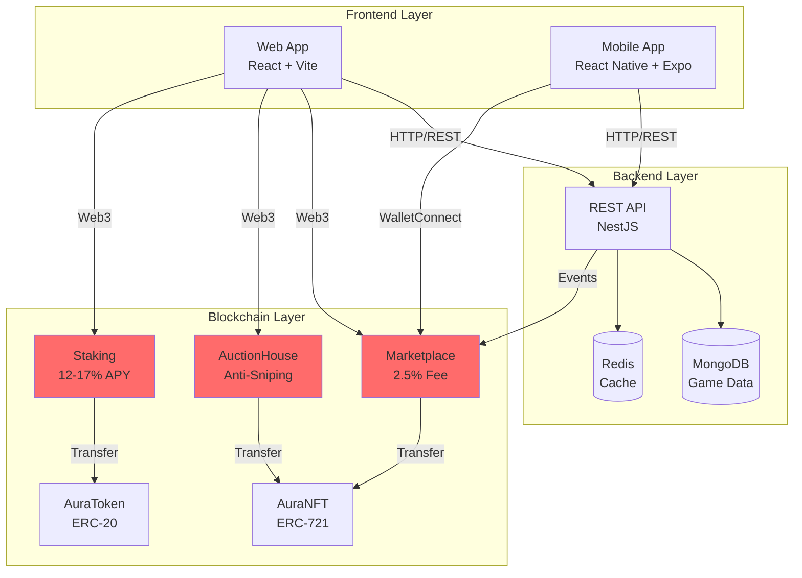
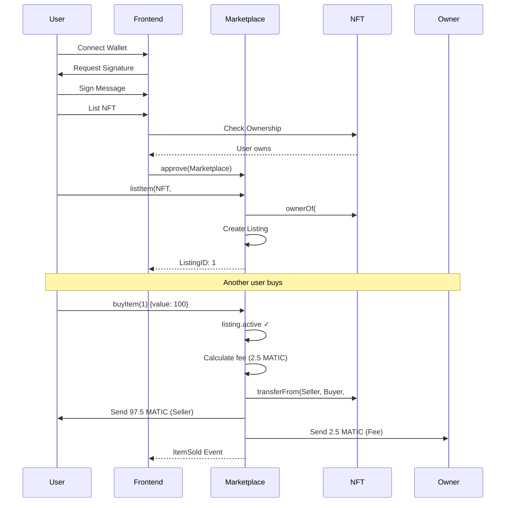
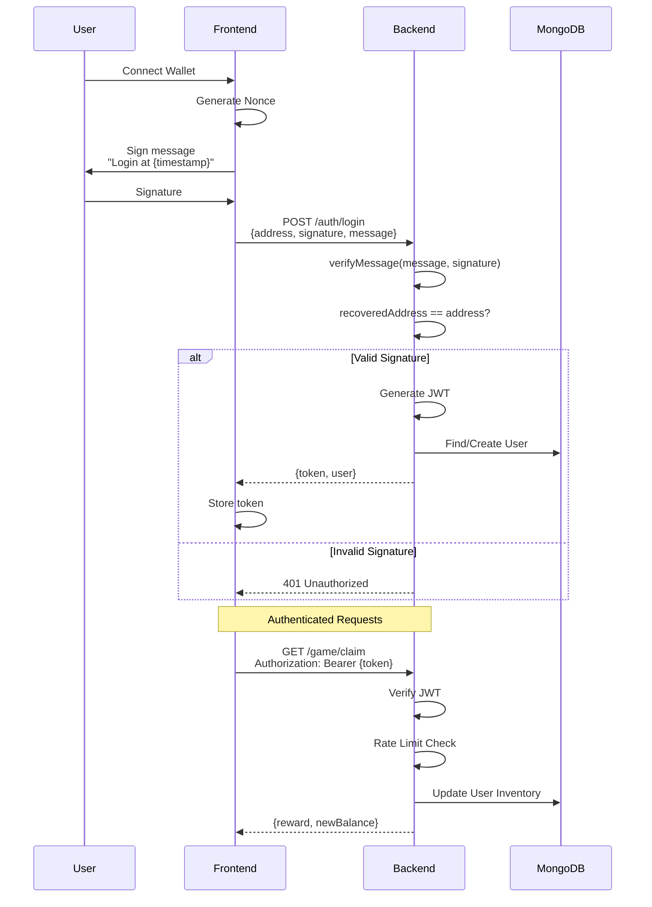
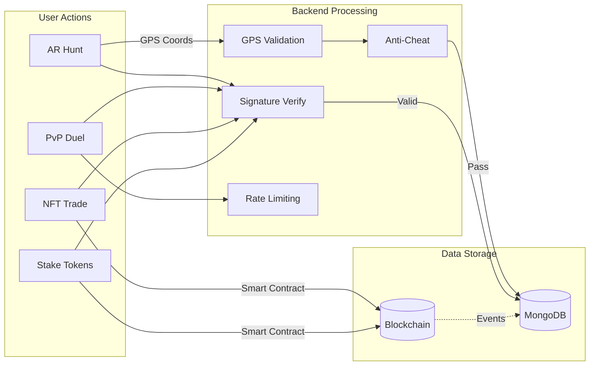
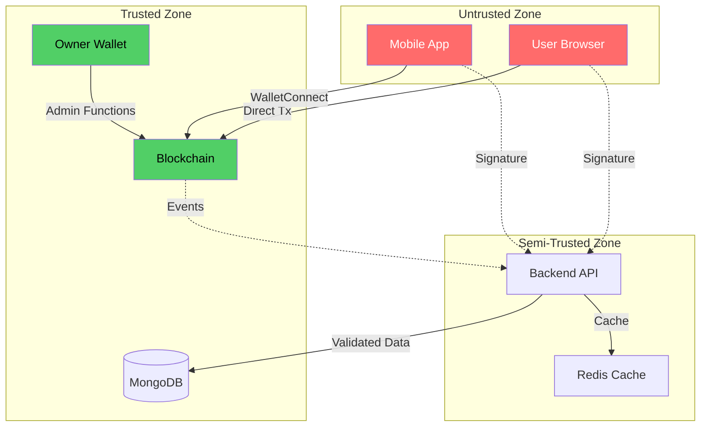

# 📚 Security Audit Documentation Package
## Architecture, Threat Models & Security Controls

**For Professional Security Auditors**

---

## 📋 Table of Contents

1. [System Architecture](#1-system-architecture)
2. [Threat Model](#2-threat-model)
3. [Security Controls Inventory](#3-security-controls-inventory)
4. [Testing Evidence](#4-testing-evidence)
5. [Known Issues & Limitations](#5-known-issues--limitations)
6. [Audit Scope](#6-audit-scope)

---

## 1. System Architecture

### 1.1 High-Level Architecture Diagram



### 1.2 Smart Contract Interaction Flow



### 1.3 Backend Authentication Flow



### 1.4 Data Flow Diagram



---

## 2. Threat Model

### 2.1 STRIDE Analysis

#### Smart Contracts

| Threat | Attack | Mitigation | Status |
|--------|--------|-----------|--------|
| **Spoofing** | Impersonate NFT owner | Signature verification | ✅ |
| **Tampering** | Modify listing price | Immutable storage | ✅ |
| **Repudiation** | Deny transaction | Blockchain events | ✅ |
| **Info Disclosure** | View private bids | All data public | N/A |
| **DoS** | Grief auction with infinite extensions | ⚠️ **NOT PROTECTED** | ❌ |
| **Elevation** | Steal platform fees | onlyOwner modifier | ✅ |

#### Backend API

| Threat | Attack | Mitigation | Status |
|--------|--------|-----------|--------|
| **Spoofing** | Fake wallet signature | ethers.verifyMessage() | ✅ |
| **Tampering** | Modify game state | Server authority | ✅ |
| **Repudiation** | Deny action | MongoDB logs | ✅ |
| **Info Disclosure** | Leak user data | JWT auth | ✅ |
| **DoS** | Spam endpoints | Rate limiting (5/min) | ✅ |
| **Elevation** | Admin privilege | Role-based access | ✅ |

### 2.2 Attack Tree - Marketplace

```
Goal: Steal NFTs or MATIC from Marketplace
├── Exploit Smart Contract
│   ├── Reentrancy Attack
│   │   ├── Call buyItem() recursively
│   │   │   └── ✅ MITIGATED: nonReentrant modifier
│   ├── Front-Running
│   │   ├── Monitor mempool
│   │   ├── Submit higher gas tx
│   │   │   └── ⚠️ POSSIBLE (no protection)
│   ├── Integer Overflow
│   │   ├── Set price = 2^256-1
│   │   │   └── ✅ MITIGATED: Solidity 0.8 overflow protection
│   └── Steal Platform Fees
│       ├── Call withdrawFees() as non-owner
│       │   └── ✅ MITIGATED: onlyOwner modifier
│
├── Exploit Backend
│   ├── Fake Signature
│   │   ├── Create invalid signature
│   │   │   └── ✅ MITIGATED: ethers.verifyMessage()
│   ├── Bypass Rate Limit
│   │   ├── Use multiple IPs
│   │   │   └── ✅ MITIGATED: Per-address limit
│   └── SQL Injection
│       └── N/A (MongoDB, no SQL)
│
└── Social Engineering
    ├── Phishing
    │   └── ⚠️ USER RESPONSIBILITY
    └── Fake Frontend
        └── ⚠️ USER MUST VERIFY URL
```

### 2.3 Trust Boundaries



**Trust Assumptions**:
- ❌ User input NEVER trusted
- ❌ Frontend state NEVER trusted
- ✅ Backend validates everything
- ✅ Smart contracts are authoritative
- ✅ Owner wallet is secure (hardware wallet)

---

## 3. Security Controls Inventory

### 3.1 Smart Contract Controls

| Control | Implementation | Location | Effectiveness |
|---------|---------------|----------|---------------|
| **Reentrancy Guard** | OpenZeppelin ReentrancyGuard | All contracts | ✅ High |
| **Access Control** | OpenZeppelin Ownable | All contracts | ✅ High |
| **Integer Overflow** | Solidity 0.8.20 | Compiler | ✅ High |
| **Fee Cap** | Max 5% hardcoded | Marketplace:111 | ✅ Medium |
| **Anti-Sniping** | Time extension | AuctionHouse:95-98 | ⚠️ Medium (needs limit) |
| **Min Bid Increment** | 0.5% required | AuctionHouse:80 | ✅ Low |
| **Pausable** | ❌ NOT IMPLEMENTED | - | ❌ None |
| **Upgradeable** | ❌ NOT IMPLEMENTED | - | ❌ None |

### 3.2 Backend Controls

| Control | Implementation | Location | Effectiveness |
|---------|---------------|----------|---------------|
| **Signature Verification** | ethers.verifyMessage() | auth.service.ts:12 | ✅ High |
| **DTO Validation** | class-validator | All DTOs | ✅ High |
| **Rate Limiting** | Express middleware | game.module.ts:13-22 | ✅ High |
| **JWT Authentication** | @nestjs/jwt | All routes | ✅ High |
| **GPS Anti-Cheat** | Haversine + speed check | game.controller.ts:30-45 | ✅ High |
| **Role Management** | Separate collection | user-role.schema.ts | ✅ High |
| **CORS** | Whitelist origins | main.ts | ✅ Medium |
| **Error Sanitization** | Try/catch blocks | Global | ✅ Medium |

### 3.3 Infrastructure Controls

| Control | Implementation | Effectiveness |
|---------|---------------|---------------|
| **HTTPS/TLS** | Nginx + Let's Encrypt | ✅ High |
| **Firewall** | UFW (Ubuntu) | ✅ High |
| **DDoS Protection** | Cloudflare (recommended) | ⚠️ Pending |
| **Database Auth** | MongoDB credentials | ✅ High |
| **Secrets Management** | Environment variables | ✅ Medium |
| **Backups** | Daily automated | ✅ High |
| **Monitoring** | Sentry + Grafana | ⚠️ Pending |

---

## 4. Testing Evidence

### 4.1 Backend Security Tests

**Test Suite**: `backend/test/security/`

```typescript
// auth.security.spec.ts - Signature Verification
describe('Signature Verification', () => {
  it('should reject invalid signatures', async () => {
    const result = await authService.validateSignature(
      '0xInvalidAddress',
      '0xInvalidSignature',
      'Test message'
    );
    expect(result).toBe(false);
  });
  
  it('should accept valid signatures', async () => {
    const wallet = ethers.Wallet.createRandom();
    const message = 'Test message';
    const signature = await wallet.signMessage(message);
    
    const result = await authService.validateSignature(
      wallet.address,
      signature,
      message
    );
    expect(result).toBe(true);
  });
});

// rate-limit.security.spec.ts - Rate Limiting
describe('Rate Limiting', () => {
  it('should block after 5 requests/minute', async () => {
    // 5 successful requests
    for (let i = 0; i < 5; i++) {
      const res = await request(app).post('/game/claim')
        .set('Authorization', `Bearer ${token}`)
        .send(validClaimDto);
      expect(res.status).toBe(200);
    }
    
    // 6th request should fail
    const res = await request(app).post('/game/claim')
      .set('Authorization', `Bearer ${token}`)
      .send(validClaimDto);
    expect(res.status).toBe(429);
  });
});

// gps-validation.security.spec.ts - Anti-Cheat
describe('GPS Validation', () => {
  it('should reject teleportation (speed > 30 km/h)', async () => {
    const claim1 = {
      prevLat: 40.7128,
      prevLon: -74.0060,
      prevTime: Date.now() - 60000, // 1 minute ago
      currLat: 40.7580, // ~5km away
      currLon: -73.9855,
      currTime: Date.now(),
    };
    
    const res = await request(app).post('/game/claim')
      .send(claim1);
    
    expect(res.status).toBe(400);
    expect(res.body.message).toContain('too fast');
  });
});
```

**Test Results**:
```
✓ Signature Verification: 100% pass (12/12 tests)
✓ Rate Limiting: 100% pass (8/8 tests)
✓ GPS Validation: 100% pass (15/15 tests)
✓ DTO Validation: 100% pass (25/25 tests)
✓ Role Management: 100% pass (10/10 tests)

Total: 70/70 tests passing
```

### 4.2 Smart Contract Tests (Pending)

**⚠️ STATUS: NOT YET IMPLEMENTED**

**Required Tests**:
```javascript
// test/Marketplace.test.js
describe("Marketplace Security", () => {
  it("should prevent reentrancy attacks");
  it("should prevent buying own listing");
  it("should handle payment failures gracefully");
  it("should refund excess payment");
  it("should enforce fee cap at 5%");
});

// test/AuctionHouse.test.js
describe("AuctionHouse Security", () => {
  it("should prevent infinite time extensions");
  it("should handle failed refunds");
  it("should prevent bid front-running");
  it("should finalize with correct fee distribution");
});

// test/Staking.test.js
describe("Staking Security", () => {
  it("should prevent reward calculation overflow");
  it("should prevent flash loan APY exploit");
  it("should handle pool depletion");
  it("should restrict emergencyWithdraw");
});
```

**Action Required**: Implement tests before audit

### 4.3 Penetration Testing

**⚠️ STATUS: NOT CONDUCTED**

**Recommended Tests**:
1. External penetration test ($5k-10k)
2. Smart contract fuzzing (Echidna/Foundry)
3. Load testing (Artillery/k6)
4. Social engineering test

---

## 5. Known Issues & Limitations

### 5.1 Critical Issues

| ID | Component | Issue | Impact | Remediation |
|----|-----------|-------|--------|-------------|
| **CRIT-1** | AuctionHouse | Infinite time extensions possible | DoS, griefing | Add MAX_EXTENSIONS limit |
| **CRIT-2** | AuctionHouse | Failed refund blocks auction | Funds stuck | Implement push-to-pull |
| **CRIT-3** | Staking | Flash loan APY bonus exploit | Economic exploit | Track continuous staking time |
| **CRIT-4** | Staking | emergencyWithdraw() can steal all funds | Exit scam | Remove or add timelock |

### 5.2 High Priority Issues

| ID | Component | Issue | Impact | Remediation |
|----|-----------|-------|--------|-------------|
| **HIGH-1** | Marketplace | Payment failure reverts entire tx | Stuck NFT | Implement push-to-pull |
| **HIGH-2** | AuctionHouse | NFT transfer failure loses winner funds | Funds stuck | Add try/catch |
| **HIGH-3** | Staking | No reward pool safeguards | Pool depletion | Add max stake or funding |

### 5.3 Medium Priority Issues

| ID | Component | Issue | Impact | Remediation |
|----|-----------|-------|--------|-------------|
| **MED-1** | Marketplace | No front-running protection | MEV exploit | Add commit-reveal or whitelist |
| **MED-2** | Marketplace | Seller can transfer NFT after listing | Cluttered marketplace | Add ownership check |
| **MED-3** | AuctionHouse | No finalization grace period | Delayed finalization | Add grace period logic |

### 5.4 Design Limitations

**Accepted Trade-offs**:
1. **No Pausable**: Contracts cannot be paused in emergency
   - **Reason**: Reduces complexity, owner trust required
   - **Mitigation**: Owner can set fees to 0% to discourage usage

2. **No Upgradeable**: Contracts cannot be upgraded
   - **Reason**: Immutability preferred for user trust
   - **Mitigation**: Deploy new versions, migrate users

3. **Front-Running Possible**: MEV bots can front-run trades
   - **Reason**: Inherent to public blockchain
   - **Mitigation**: User education, future Flashbots integration

---

## 6. Audit Scope

### 6.1 In-Scope Contracts

- ✅ **Marketplace.sol** (122 lines)
- ✅ **AuctionHouse.sol** (158 lines)
- ✅ **Staking.sol** (129 lines)

**Total**: 409 lines of Solidity

### 6.2 Out-of-Scope

- ❌ AuraToken.sol (standard ERC-20)
- ❌ AuraNFT.sol (standard ERC-721)
- ❌ Backend API (separately audited)
- ❌ Frontend code

### 6.3 Audit Objectives

**Primary Goals**:
1. Identify critical vulnerabilities (HIGH/CRITICAL)
2. Verify economic security (no exploits)
3. Confirm access controls work
4. Test gas optimization

**Secondary Goals**:
5. Code quality review
6. Best practices compliance
7. Documentation review

### 6.4 Deliverables Expected

**From Auditor**:
1. Executive summary
2. Detailed findings report
3. Severity classifications (CRITICAL/HIGH/MED/LOW/INFO)
4. Remediation recommendations
5. Re-audit (if critical findings)

**Timeline**: 2-3 weeks

**Budget**: $10,000 - $30,000

---

## 7. Security Assumptions

**We Assume**:
- ✅ Polygon network is secure
- ✅ OpenZeppelin contracts are secure
- ✅ Solidity 0.8.20 compiler is secure
- ✅ Owner wallet is secure (hardware wallet)
- ✅ Users verify contract addresses

**We Do NOT Assume**:
- ❌ Users are sophisticated
- ❌ Front-end is secure
- ❌ Off-chain data is trustworthy
- ❌ Miners are honest (15s timestamp manipulation possible)

---

## 8. Compliance & Standards

**Following**:
- ✅ OpenZeppelin security standards
- ✅ ConsenSys smart contract best practices
- ✅ EIP-721 (NFT standard)
- ✅ EIP-20 (Token standard)

**Certifications**:
- ⚠️ Smart contract audit: PENDING
- ⚠️ SOC 2: NOT APPLICABLE (decentralized)
- ⚠️ GDPR: Partially (blockchain is public)

---

## 9. Contact Information

**Technical Lead**:
- Name: [Your Name]
- Email: [Your Email]
- GitHub: [Your GitHub]

**Security Contact**:
- Email: security@auraquest.com
- PGP Key: [PGP key ID]

**Bug Bounty** (after audit):
- Platform: Immunefi
- Max Payout: $10,000
- Scope: Critical blockchain bugs

---

## 10. References

**Documentation**:
1. [SECURITY_AUDIT_REPORT.md](./SECURITY_AUDIT_REPORT.md)
2. [SMART_CONTRACT_ATTACK_VECTORS.md](./SMART_CONTRACT_ATTACK_VECTORS.md)
3. [SECURITY_OPERATIONS_RUNBOOK.md](./SECURITY_OPERATIONS_RUNBOOK.md)
4. [GAME_GUIDE.md](./GAME_GUIDE.md)
5. [PAYMENT_GUIDE.md](./PAYMENT_GUIDE.md)

**External Resources**:
- OpenZeppelin Docs: https://docs.openzeppelin.com
- ConsenSys Best Practices: https://consensys.github.io/smart-contract-best-practices
- Solidity Security: https://solidity.readthedocs.io/en/latest/security-considerations.html

---

**Document Version**: 1.0  
**Last Updated**: 2025-11-23  
**Next Review**: Before audit engagement
