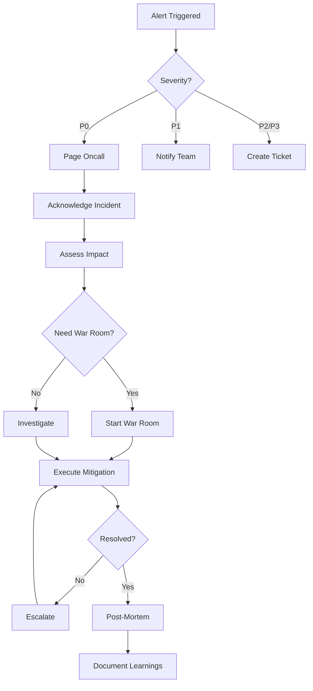

# 🚨 Security Operations Runbook

**Emergency procedures, monitoring, and incident response for AuraAuction Quest**

---

## 📊 1. Monitoring & Alerting

### Critical Metrics to Monitor

#### Backend Application
```yaml
Metrics:
  - Response time: < 200ms (p95)
  - Error rate: < 0.1%
  - Request rate: Track baseline
  - Database connections: < 80% of max
  - Redis memory: < 80% of max
  - CPU usage: < 70%
  - Memory usage: < 80%

Alerts:
  - Response time > 500ms for 2 minutes: Page oncall
  - Error rate > 1% for 5 minutes: Page oncall
  - Database connection pool > 90%: Page oncall
  - Server down: Immediate page
```

#### Smart Contracts
```yaml
Metrics:
  - Transaction volume (hourly/daily)
  - Gas prices (track spikes)
  - Contract balance changes
  - Large transactions (> $1000)
  - Failed transactions rate
  - Owner wallet balance

Alerts:
  - Large withdrawal (> $5000): Immediate page
  - Failed tx rate > 10%: Investigate
  - Owner balance < 10 MATIC: Refill needed
  - Unusual contract interaction: Review
```

#### Mobile Apps
```yaml
Metrics:
  - Crash rate: < 0.5%
  - API error rate
  - App store rating
  - Download/uninstall ratio
  - Session duration

Alerts:
  - Crash rate > 2%: Investigate immediately
  - Rating drops below 4.0: Review feedback
```

### Monitoring Tools Setup

**1. Sentry (Error Tracking)**
```typescript
// Sentry Configuration
{
  dsn: process.env.SENTRY_DSN,
  environment: 'production',
  tracesSampleRate: 0.1,
  
  beforeSend(event) {
    // Scrub sensitive data
    if (event.request?.headers) {
      delete event.request.headers.authorization;
    }
    return event;
  },
  
  integrations: [
    new ProfilingIntegration(),
  ],
}
```

**2. Grafana Dashboard**
```yaml
Dashboards:
  - System Health:
      - CPU, Memory, Disk
      - Network I/O
      - Process status
  
  - Application:
      - Request rate
      - Response times (p50, p95, p99)
      - Error rates by endpoint
      - Active users
  
  - Database:
      - Queries per second
      - Slow queries
      - Connection pool
      - Index usage
  
  - Blockchain:
      - Transaction volume
      - Gas usage
      - Contract interactions
```

**3. UptimeRobot (Uptime Monitoring)**
```yaml
Monitors:
  - API Health Check:
      URL: https://api.auraquest.com/health
      Interval: 5 minutes
      Alert: Email + SMS
  
  - Frontend:
      URL: https://auraquest.com
      Interval: 5 minutes
      Alert: Email
  
  - MongoDB:
      Type: Port Monitor
      Port: 27017
      Interval: 5 minutes
```

**4. Tenderly (Smart Contract Monitoring)**
```yaml
Alerts:
  - Transaction Value:
      Condition: value > 10 ETH
      Action: Immediate notification
  
  - Failed Transactions:
      Condition: status == failed
      Action: Log to Slack
  
  - Admin Function Call:
      Condition: function in [transferOwnership, updatePlatformFee]
      Action: Immediate page + require 2FA confirmation
```

---

## 🚨 2. Incident Response Procedures

### Severity Levels

**P0 - Critical (Response: Immediate)**
- Complete service outage
- Data breach
- Smart contract exploit
- Payment processing failure
- Security vulnerability actively exploited

**P1 - High (Response: < 30 minutes)**
- Partial service degradation
- API error rate > 5%
- Database performance issues
- Mobile app crashes > 2%

**P2 - Medium (Response: < 2 hours)**
- Non-critical feature broken
- Performance degradation
- Elevated error rates (1-5%)

**P3 - Low (Response: Next business day)**
- Minor bugs
- UI issues
- Feature requests

### Incident Response Workflow



### P0 Incident: Smart Contract Exploit

**Immediate Actions (First 5 minutes):**
```bash
1. PAUSE ALL CONTRACTS (if pause function exists)
   - Call marketplace.pause()
   - Call auctionHouse.pause()
   - Call staking.pause()

2. DISABLE BACKEND APIs
   systemctl stop aura-quest-backend
   
3. TAKE FRONTEND OFFLINE (maintenance mode)
   - Deploy maintenance page to Vercel
   
4. ALERT ALL USERS
   - App notification: "Maintenance in progress"
   - Twitter/Discord announcement
```

**Investigation (First 30 minutes):**
```yaml
Steps:
  1. Identify attack transaction hash
  2. Analyze transaction in Tenderly
  3. Determine attack vector
  4. Calculate financial impact
  5. Check if funds can be recovered
  6. Assess if other contracts vulnerable
```

**Mitigation Options:**
```yaml
Option A - Pause & Fix:
  1. Keep contracts paused
  2. Deploy fixed contracts
  3. Migrate state if possible
  4. Gradually resume services

Option B - Emergency Withdrawal:
  1. Call emergencyWithdraw() (if exists)
  2. Transfer funds to secure multisig
  3. Notify users of next steps

Option C - Coordinated Response:
  1. Contact Polygon team
  2. Request transaction reversal (extremely rare)
  3. Work with exchanges to freeze stolen funds
```

**Communication Template:**
```markdown
🚨 URGENT: Security Incident Notice

We've detected suspicious activity on our smart contracts and have
temporarily paused all operations to protect user funds.

Status: INVESTIGATING
Impact: [Describe impact]
User Funds: [Safe/At Risk/Unknown]
ETA: Updates every 30 minutes

What we're doing:
- Paused all contracts
- Analyzing the issue
- Working with security experts

What you should do:
- DO NOT interact with contracts
- Wait for official updates
- Verify updates on official channels only

Updates: twitter.com/auraquest
```

### P0 Incident: Database Compromise

**Immediate Actions:**
```bash
1. ISOLATE DATABASE
   ufw deny from any to any port 27017
   
2. KILL ALL CONNECTIONS
   mongo admin --eval "db.shutdownServer()"
   
3. ROTATE ALL CREDENTIALS
   - Database passwords
   - API keys
   - JWT secrets
   
4. RESTORE FROM BACKUP
   mongorestore --drop /backups/latest
```

### P0 Incident: API Server Compromised

**Immediate Actions:**
```bash
1. TAKE SERVER OFFLINE
   systemctl stop nginx
   systemctl stop aura-quest-backend
   
2. PRESERVE EVIDENCE
   tar -czf /evidence/server-$(date +%Y%m%d-%H%M%S).tar.gz /var/log /var/www
   
3. SPIN UP CLEAN INSTANCE
   - Deploy from known-good code
   - New IP address
   - Fresh credentials
   
4. FORENSIC ANALYSIS
   - Check access logs
   - Review file modifications
   - Analyze running processes
```

---

## 🔄 3. Rollback Strategies

### Smart Contract Rollback

**⚠️ WARNING: Smart contracts are IMMUTABLE. Rollback is complex.**

**Option 1: Deploy New Version + State Migration**
```solidity
// NewMarketplace.sol
contract MarketplaceV2 is Marketplace {
    address public legacyContract;
    
    function migrateListings(uint256[] calldata listingIds) external onlyOwner {
        ILegacyMarketplace legacy = ILegacyMarketplace(legacyContract);
        
        for (uint256 i = 0; i < listingIds.length; i++) {
            // Copy listing from old contract
            // ... migration logic
        }
    }
}
```

**Steps:**
```yaml
1. Deploy new contract
2. Pause old contract
3. Migrate critical state
4. Update frontend to point to new address
5. Gradually migrate remaining data
6. Deprecate old contract after 90 days
```

**Option 2: Proxy Pattern (If Implemented)**
```solidity
// Only if using upgradeable contracts
function upgradeTo(address newImplementation) external onlyOwner {
    _upgradeTo(newImplementation);
}
```

### Backend Rollback

**Zero-Downtime Rollback:**
```bash
#!/bin/bash
# rollback-backend.sh

set -e

CURRENT_VERSION=$(cat /var/www/current-version.txt)
PREVIOUS_VERSION=$(cat /var/www/previous-version.txt)

echo "Rolling back from $CURRENT_VERSION to $PREVIOUS_VERSION"

# 1. Switch symlink to previous version
ln -sfn /var/www/releases/$PREVIOUS_VERSION /var/www/current

# 2. Restart PM2
pm2 restart aura-quest-backend

# 3. Wait for health check
sleep 10
curl -f https://api.auraquest.com/health || exit 1

# 4. Verify rollback
echo "✅ Rollback complete"
echo $PREVIOUS_VERSION > /var/www/current-version.txt
```

**Database Rollback:**
```bash
#!/bin/bash
# rollback-database.sh

BACKUP_FILE=$1

if [ -z "$BACKUP_FILE" ]; then
    echo "Usage: ./rollback-database.sh /backups/backup_20231123.tar.gz"
    exit 1
fi

# 1. Stop application
pm2 stop aura-quest-backend

# 2. Backup current state
mongodump --out /backups/pre-rollback-$(date +%Y%m%d-%H%M%S)

# 3. Restore from backup
tar -xzf $BACKUP_FILE -C /tmp
mongorestore --drop /tmp/backup_*

# 4. Restart application
pm2 start aura-quest-backend

# 5. Verify
sleep 10
curl -f https://api.auraquest.com/health
```

### Frontend Rollback (Vercel)

**Instant Rollback:**
```bash
# Vercel keeps all deployments
# Rollback via UI or CLI

vercel rollback
# Or specific deployment
vercel rollback <deployment-url>
```

### Mobile App Rollback

**iOS:**
```yaml
App Store:
  - Cannot rollback published apps
  - Must submit new version (expedited review possible)
  - Can remove app from store temporarily
  
Solution:
  - Feature flags to disable broken features
  - Backend version gating
  - Hotfix release (1-2 days)
```

**Android:**
```yaml
Play Store:
  - Cannot rollback published apps
  - Can halt rollout at X%
  - Can deactivate APK (prevents new downloads)
  
Solution:
  - Staged rollout (10% → 50% → 100%)
  - Backend feature flags
  - Hotfix release (hours to 1 day)
```

---

## 🔧 4. Emergency Procedures

### Emergency: Smart Contract Pause

**If Pausable:**
```typescript
import { ethers } from "ethers";

async function emergencyPause() {
  const provider = new ethers.JsonRpcProvider(process.env.RPC_URL);
  const wallet = new ethers.Wallet(process.env.OWNER_PRIVATE_KEY, provider);
  
  const marketplace = new ethers.Contract(
    process.env.MARKETPLACE_ADDRESS,
    ["function pause() external"],
    wallet
  );
  
  // Pause contract
  const tx = await marketplace.pause();
  console.log("Pause transaction:", tx.hash);
  
  await tx.wait();
  console.log("✅ Contract paused");
  
  // Notify team
  await notifySlack("🚨 MARKETPLACE CONTRACT PAUSED");
}
```

### Emergency: Database Restore

**Full Restore Procedure:**
```bash
#!/bin/bash
# emergency-db-restore.sh

set -e

echo "🚨 EMERGENCY DATABASE RESTORE"
echo "This will OVERWRITE current database"
read -p "Continue? (yes/no): " confirm

if [ "$confirm" != "yes" ]; then
    exit 1
fi

# 1. Stop application
pm2 stop all

# 2. List available backups
ls -lh /backups/*.tar.gz

# 3. Select backup
read -p "Enter backup filename: " BACKUP

# 4. Backup current state
CURRENT_BACKUP="/backups/emergency-backup-$(date +%Y%m%d-%H%M%S).tar.gz"
mongodump --gzip --archive=$CURRENT_BACKUP

# 5. Restore selected backup
tar -xzf /backups/$BACKUP -C /tmp
mongorestore --drop --gzip $(find /tmp -name "*.bson" | head -1 | xargs dirname)

# 6. Verify restore
mongo --eval "db.stats()"

# 7. Restart application
pm2 start all

echo "✅ Database restored from $BACKUP"
echo "💾 Current state backed up to $CURRENT_BACKUP"
```

### Emergency: Server Compromise

**Immediate Lockdown:**
```bash
#!/bin/bash
# lockdown.sh - Run if server compromised

# 1. Block all incoming traffic except your IP
YOUR_IP="1.2.3.4"  # CHANGE THIS
ufw default deny incoming
ufw allow from $YOUR_IP to any port 22
ufw enable

# 2. Kill all user sessions except current
who | grep -v $(tty) | awk '{print $2}' | xargs -I {} pkill -9 -t {}

# 3. Disable all services
systemctl stop nginx
systemctl stop aura-quest-backend
systemctl stop mongod

# 4. Snapshot disk for forensics
dd if=/dev/vda of=/mnt/forensic-image.dd bs=4M

# 5. Alert team
curl -X POST $SLACK_WEBHOOK -d '{"text":"🚨 SERVER LOCKDOWN INITIATED"}'

echo "🚨 Server locked down. Only accessible from $YOUR_IP"
```

### Emergency: Rate Limit Override

**If legitimate spike (e.g., viral event):**
```typescript
// Temporary rate limit increase
// backend/src/middleware/rate-limit.middleware.ts

export const createEmergencyRateLimiter = () => {
  return rateLimit({
    windowMs: 60000,
    max: 1000, // Increased from 100
    message: 'Rate limit exceeded',
    standardHeaders: true,
  });
};

// Apply via PM2 restart with env var
// EMERGENCY_MODE=true pm2 restart aura-quest-backend
```

---

## 📞 5. Contact Information

### On-Call Rotation
```yaml
Primary:
  - Name: [Your Name]
  - Phone: [Your Phone]
  - Telegram: @yourhandle
  
Secondary:
  - Name: [Teammate Name]
  - Phone: [Phone]
  - Email: [Email]

Escalation:
  - CTO: [Contact]
  - Security Team: security@auraquest.com
```

### External Contacts
```yaml
Smart Contract Auditor:
  - Company: OpenZeppelin/ConsenSys
  - Contact: [Email/Phone]
  - Emergency: [Emergency line]

Infrastructure:
  - DigitalOcean Support: support.digitalocean.com
  - MongoDB Atlas: support.mongodb.com
  - Vercel Support: vercel.com/support

Legal:
  - Law Firm: [Name]
  - Contact: [Email/Phone]

Insurance:
  - Crypto Insurance: [Provider]
  - Policy #: [Number]
```

---

## 📋 6. Post-Incident Review

### Post-Mortem Template

```markdown
# Post-Mortem: [Incident Title]

**Date**: YYYY-MM-DD
**Duration**: X hours
**Severity**: P0/P1/P2/P3
**Impact**: [User impact, financial impact]

## Timeline
- HH:MM - Alert triggered
- HH:MM - Incident acknowledged
- HH:MM - Root cause identified
- HH:MM - Mitigation deployed
- HH:MM - Incident resolved

## Root Cause
[Detailed explanation of what went wrong]

## Impact
- Users affected: X
- Financial impact: $X
- Downtime: X minutes
- Data lost: Yes/No

## What Went Well
- [What worked in the response]

## What Went Wrong
- [What didn't work]

## Action Items
- [ ] [Action 1] - Owner: [Name] - Due: [Date]
- [ ] [Action 2] - Owner: [Name] - Due: [Date]

## Lessons Learned
[Key takeaways]
```

---

## 🎯 7. Runbook Maintenance

**Update Frequency:**
- Review quarterly
- Update after each P0/P1 incident
- Update after architecture changes

**Version Control:**
- Keep in Git repository
- Tag versions
- Require PR approval for changes

**Testing:**
- Simulate P0 incident quarterly
- Test rollback procedures monthly
- Verify contact information monthly

---

**Last Updated**: 2025-11-23  
**Next Review**: 2026-02-23  
**Version**: 1.0
